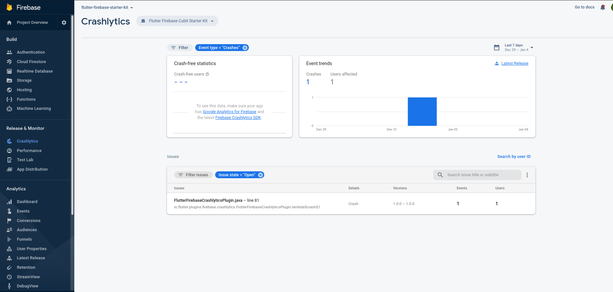

# Flutter Firebase Cubit Starter kit (Auth)

This is a Flutter starter kit project where firebase is used as the backend and the cubit is used as the state management architecture.

## Whats included

- Walkthrough Screens
- Firebase Login and Sign up
- Firebase Crashlytics

### Waltthrough Screens

<table>
     <tr>
     <td></td>
     <td></td>
     <td></td>
     </tr>
</table>

  

### Firebase Login and Sign up

  

### Firbase Crashlytics

